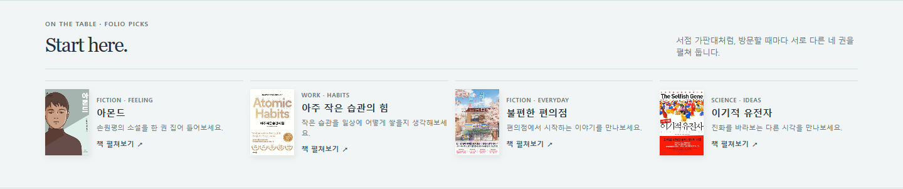
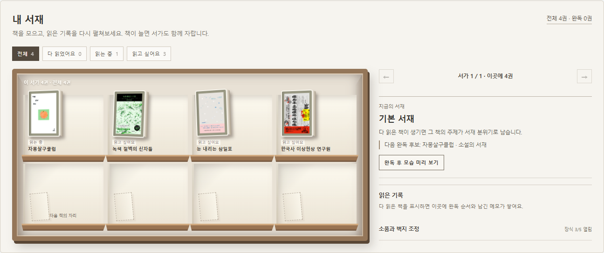

# folio

**읽은 책에서 취향의 단서를 찾고, 다음 책을 고르는 웹페이지**

**시연 사이트:** https://folio-murex-pi.vercel.app/

**발표 자료:** [PDF로 바로 보기 (8장)](docs/presentation/folio-presentation-2026-10-08-v18-view.pdf) · [PPT 파일 내려받기](docs/presentation/folio-presentation-2026-10-08-v18.pptx)

GitHub는 PPT 슬라이드를 화면에 미리 보여주지 않습니다. PPT 파일 페이지에서는 **Download raw file**을 눌러 저장한 뒤 PowerPoint나 Keynote로 여세요.

첫 서가는 folio가 편집한 예시 목록입니다. 현재 공개 사이트에서는 알라딘의 주간 도서 목록과 도서관 정보나루·Open Library의 책 검색, Gemini 추천이 작동합니다. Google Books 검색은 API 키가 없어 아직 연결되지 않았습니다.

여러 책을 읽다 보면 지금 읽는 책과 읽고 싶은 책이 흩어지고, 어떤 책을 왜 좋아했는지도 잊기 쉽습니다. folio는 책을 한곳에 기록하고 **좋아했던 이유를 다음 책 선택에 활용**하도록 만든 개인 프로젝트입니다. 독서량으로 사람을 평가하거나 몇 권만으로 취향을 단정하지 않습니다.



## 이렇게 사용합니다

1. 첫 가판대나 검색에서 책을 찾습니다. 소설 분야, 최근 출간, 한국어 책, 소개 유무, 분량으로 검색 결과를 좁힐 수 있습니다.
2. 책을 **읽고 싶어요 / 읽는 중 / 다 읽었어요** 중 하나에 담고, 완독 날짜와 메모를 남깁니다.
3. 좋아한 책과 그 이유를 함께 기록합니다. 예를 들어 ‘아몬드’에서 ‘인물과 관계’가 좋았다면, 다른 책의 소개에도 같은 단서가 있는지 살펴봅니다.
4. 지금 관심 있는 주제·읽는 목적·분량을 고르고, 근거가 확인된 후보를 최대 세 권까지 비교합니다. 마음에 드는 책은 바로 ‘읽는 중’으로 옮깁니다.

| 기능 | 구현한 경험 |
| --- | --- |
| 책 발견 | 알라딘 주간 목록과 도서관 정보나루·Open Library 검색을 사용합니다. Google Books는 인증키를 연결하면 추가됩니다. 판매 순위와 출간일은 구분해 보여줍니다. |
| 취향과 추천 | 좋아한 책·이유, 맞지 않았던 이유, 추천 이유 평가를 다음 책 순서에 반영합니다. Gemini가 쓴 이유는 실제 후보와 책 소개의 표현을 다시 대조합니다. 근거가 부족하면 추천 칸을 비워 둡니다. |
| 내 책장 | 읽기 상태·메모·완독 기록·주제별 서가·다음에 읽을 세 권을 관리합니다. 한 서가에 12권을 보여주고 13권부터 다음 쪽으로 넘깁니다. |
| 책 옆의 발견 | 소품 사진에서 포함된 잡지 호와 구성을 찾습니다. 출처를 확인한 편집 목록 18개에 검색·정렬·보드 저장·확인일 표시를 붙였습니다. |
| 계정 | Google 로그인과 계정별 책장 저장을 연결했습니다. 로그인 전 기록은 현재 브라우저에 남습니다. |



## 왜 이렇게 만들었나요?

수업의 자기이해 실습에서 AI가 답을 단정하기보다 **근거를 보여주고 스스로 돌아보게 하는 방식**에 관심이 생겼습니다. folio에서는 사주 대신 실제로 읽고 고른 책의 기록을 출발점으로 삼았습니다. 핵심 흐름은 **기록 → 취향의 단서 → 근거 있는 후보 비교 → 다시 기록**입니다. 잡지 소품은 책을 고르는 과정에 더한 작은 즐거움입니다.

개발 중 스스로 내린 선택과 그 근거는 [제품·데이터 판단 기록](docs/DECISIONS.md)에 정리했습니다. 수업의 자료 분석, 여러 AI 작업자에게 업무 분담, AI 연결·검증, 반복 점검을 어디에 적용했는지는 [수업 적용 기록](docs/LEARNING.md)에서 볼 수 있습니다.

## 검증한 범위

- 2026-10-08 공개 사이트에서 도서관 정보나루 연결 상태와 `아몬드` 검색의 실제 국내 도서 결과를 확인했습니다. 화면의 `국내 도서 인증키 미연결` 안내도 사라졌습니다.
- 같은 날 공개 사이트에서 실제 국내 도서 소개로 Gemini 추천 1건을 받았고, 웹 화면에 **AI 추천** 이유가 표시되는 것을 확인했습니다. 추천 만족도 검증과는 별개의 기능 확인입니다.
- 서버·추천 연결 자동 시험 **26개가 통과**했습니다.
- 시연용 책 **13권을 담아** 첫 서가 12권과 다음 서가 1권, 완독 필터와 읽은 기록을 화면에서 확인했습니다.
- 실제 Google 로그인으로 **한 계정의 책장 불러오기**를 확인했습니다.
- 추천 조건 6개를 점검했을 때 **2개는 책 소개에서 목적 관련 표현을 확인**했고, 4개는 근거가 부족해 상단 추천을 비웠습니다. 이는 개발 중 자료 검증 결과이며, 실제 독자 만족도나 추천 정확도가 아닙니다. [평가 기록](eval/recommendation-eval-2026-10-06-v03.md)

다른 기기에서의 복원, 서로 다른 두 계정의 분리, 실제 독자의 책 선택 평가, 첫 월간 소품 갱신은 아직 확인이 필요합니다. 자세한 근거와 남은 점검은 [검증 기록](docs/VALIDATION.md)에 적었습니다.

## 로컬에서 실행하기

Node.js를 설치한 뒤 저장소 폴더에서 다음 명령을 실행하고 `http://localhost:8768`을 엽니다.

```powershell
Copy-Item .env.example .env
node --env-file=.env server.cjs
```

`.env`는 외부 서비스에 접속할 때 쓰는 설정값을 로컬에 두는 파일입니다. 위처럼 복사한 뒤 **본인이 발급받은 값**을 넣어야 Google Books·도서관 정보나루·Gemini가 연결됩니다. Google 로그인에는 별도의 Google·Supabase 프로젝트 설정이 필요합니다. API 키는 외부 서비스를 사용할 때 제시하는 비밀 인증값이므로 GitHub에 올리지 않습니다. 설정값 없이도 편집 예시 책으로 화면을 둘러볼 수 있지만, 실시간 책 검색·AI 추천은 제한됩니다. `dist/index.html`을 파일로 직접 열면 서버 기능이 작동하지 않습니다. [설정과 데이터 연결 자세히 보기](docs/SETUP.md)

## 저장소 안내

- `dist/` — 웹 화면과 책장·취향·소품 기능
- `server.cjs`, `lib/` — 도서 검색과 AI 추천, 인증키를 브라우저 밖에 두는 서버
- `supabase/migrations/` — 계정별 책장 접근 제한 설정
- `eval/` — 추천 근거를 점검한 과정과 사례
- `docs/` — 판단·수업 적용·검증·실행 설정
- `docs/presentation/` — 공개 발표용 PPT
- `versions/` — 이전 구현과 문서의 보존본

개인 발표 대본은 이 공개 저장소에 넣지 않았습니다. 소품 목록은 확인일이 붙은 **편집 자료**이며 실시간 재고·가격 정보가 아닙니다. 외부 도서 소개·표지는 제공처에 따라 빠지거나 바뀔 수 있습니다.
